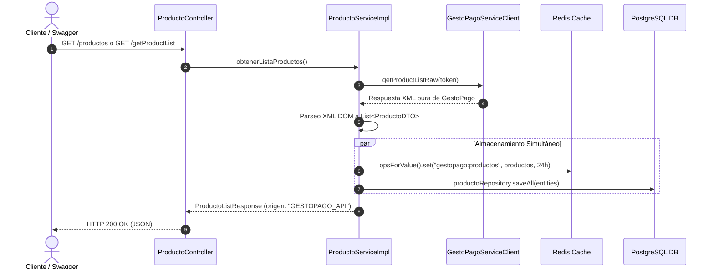
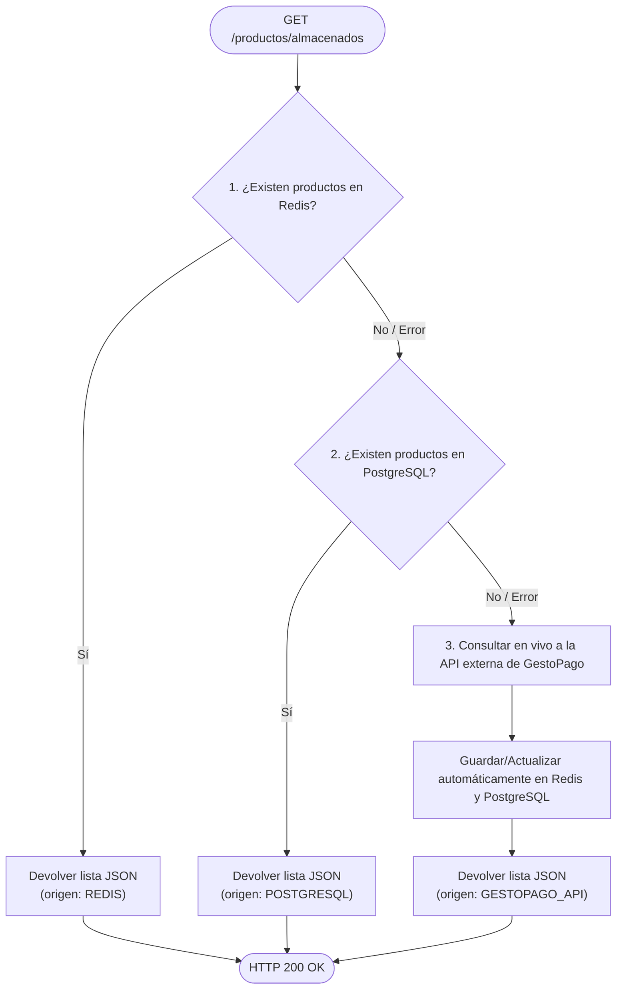

# GestoPago - Microservicio de Integración de Servicios y Productos

Este microservicio desarrollado en **Spring Boot** permite la consulta, sincronización y almacenamiento persistente/caché de la lista de productos y servicios de la plataforma **GestoPago**.

El sistema cuenta con una arquitectura de alta disponibilidad y tolerancia a fallos mediante el uso de **Redis** como almacenamiento primario en memoria (Caché) y **PostgreSQL** como almacenamiento persistente en disco (Base de Datos), complementado con migraciones de **Flyway** y documentación interactiva **OpenAPI / Swagger UI**.

---

## Documentación Adicional

Para un análisis detallado y guías paso a paso, consulta los siguientes documentos:

* **[Manual Técnico: Integración Endpoint `getProductList`](documentacion/manual_tecnico_getProductList.md)**  
  * *Resumen*: Documenta la arquitectura técnica, configuración de Spring Cloud OpenFeign, parseo seguro de XML DOM a JSON, manejo dinámico del Bearer Token y contratos de endpoints.
* **[Manual de Evidencia: Almacenamiento Redis y PostgreSQL](documentacion/manual_evidencia_almacenamiento_redis_postgres.md)**  
  * *Resumen*: Documenta la estrategia de almacenamiento dual (caché rápido en Redis + persistencia permanente en PostgreSQL), así como la evidencia de fallback y resiliencia ante caídas de componentes.
* **[Manual de Pruebas Manuales y Evidencia de Ejecución](documentacion/manual_pruebas_y_evidencias.md)**  
  * *Resumen*: Guía paso a paso para la ejecución de pruebas manuales (TC-01 a TC-06) con marcadores de evidencia visual para Swagger UI, PostgreSQL, Redis CLI y Docker.

---

## Arquitectura y Flujos de Datos

### 1. Diagrama de Flujo: Consulta a API Externa y Almacenamiento Simultáneo (`GET /productos` / `GET /getProductList`)

Cuando un cliente solicita la actualización o consulta directa desde la API remota de GestoPago:



---

### 2. Diagrama de Flujo: Consulta a Almacenamiento Local en Cascada (`GET /productos/almacenados`)

Cuando un cliente solicita los productos almacenados localmente, el sistema ejecuta una estrategia resiliente de 3 niveles con auto-actualización:



---

## Tecnologías y Herramientas

* **Java 17** / **Spring Boot 3.x**
* **Spring Data JPA** & **Hibernate** (PostgreSQL)
* **Spring Data Redis** (Memoria caché de alto rendimiento)
* **Spring Cloud OpenFeign** (Consumo cliente HTTP de API REST/XML)
* **Flyway Migration** (Control de versiones del esquema de base de datos)
* **OpenAPI 3.0 / Swagger UI** (Documentación interactiva de endpoints)
* **Lombok** (Generación de código boilerplate)
* **JUnit 5 & Mockito** (Pruebas unitarias de servicios)

---

## Endpoints REST Principales

| Método | Endpoint | Origen Respuesta | Descripción |
| :--- | :--- | :--- | :--- |
| `GET` | `/productos` | `GESTOPAGO_API` | Consulta en vivo la API de GestoPago usando el token activo en DB y actualiza Redis + PostgreSQL. |
| `GET` | `/getProductList` | `GESTOPAGO_API` | Consulta en vivo permitiendo enviar un Token en el Header `Authorization: Bearer <token>`. |
| `GET` | `/productos/almacenados` | `REDIS` / `POSTGRESQL` / `GESTOPAGO_API` | Consulta inteligente en 3 niveles (Redis $\rightarrow$ PostgreSQL $\rightarrow$ API GestoPago con auto-guardado). |

---

## Configuración del Proyecto

Las propiedades de configuración principales se definen en `src/main/resources/application.properties`:

```properties
# Servidor
server.port=8080

# PostgreSQL DB
spring.datasource.url=jdbc:postgresql://localhost:5432/db_gestopago
spring.datasource.username=postgres
spring.datasource.password=root

# Redis Cache
spring.data.redis.host=localhost
spring.data.redis.port=6379

# Credenciales GestoPago
gestopago.api.url=https://api.gestopago.com
gestopago.auth.id-distribuidor=83
gestopago.auth.codigo-dispositivo=GPS83-TPV-17
```

---

## Ejecución de Pruebas Unitarias

Para ejecutar el suite completo de pruebas unitarias con Gradle:

```bash
./gradlew test
```

Para iniciar la aplicación en entorno local:

```bash
./gradlew bootRun
```