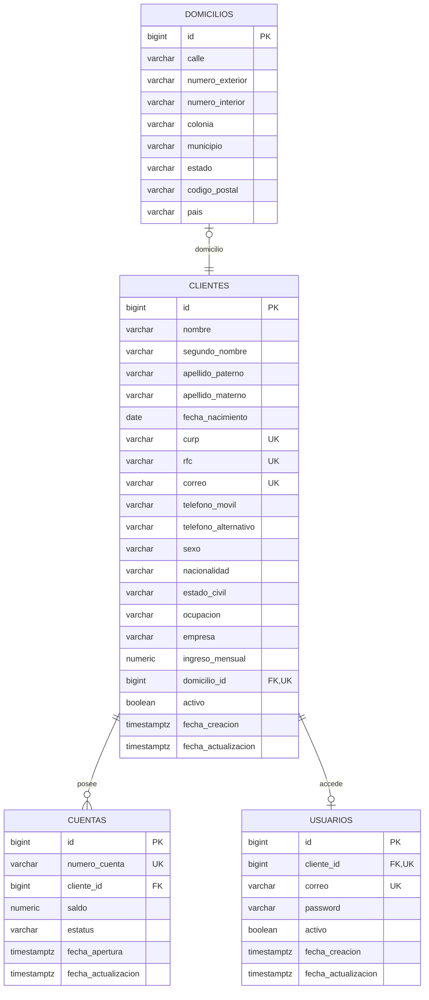

# Integración de clientes persona física

## Propósito y alcance

El módulo registra clientes persona física, sus domicilios, cuentas bancarias y usuarios de acceso. La persistencia usa Spring Data JPA/Hibernate y PostgreSQL; Flyway crea el esquema. Las contraseñas se almacenan con BCrypt y la API emite JWT para autenticación sin estado.

## Diagrama entidad-relación



## Persistencia y reglas de esquema

Las migraciones `V3__create_onboarding_tables.sql` y `V4__enforce_onboarding_constraints.sql` crean y refuerzan el esquema:

- `BIGSERIAL` para claves sustitutas; `VARCHAR` acotado para identificadores y datos de longitud limitada; `NUMERIC(15,2)` para dinero; `DATE` para nacimiento; `TIMESTAMP WITH TIME ZONE` para marcas de tiempo.
- CURP, RFC, correo del cliente, correo del usuario y número de cuenta son únicos. `clientes.domicilio_id` también es único para asegurar la relación 1:1; un cliente puede tener varias cuentas y como máximo un usuario.
- Las llaves foráneas conectan las tablas. Las relaciones con cuentas y domicilios impiden borrados físicos que rompan la asociación; la baja funcional es lógica.
- Ingreso mensual debe ser mayor que cero; el saldo no puede ser negativo; el estatus de cuenta está restringido a los valores definidos.
- La base de datos verifica diez dígitos para teléfonos y cinco dígitos para el código postal. Los identificadores y correos únicos ya están indexados por PostgreSQL mediante sus restricciones `UNIQUE`; V4 elimina índices duplicados explícitos.
- Antes de aplicar V4 sobre una base con datos previos, verificar que no haya varios clientes con el mismo `domicilio_id` ni teléfonos o códigos postales con formato inválido. Flyway detendrá la migración si los datos existentes infringen las nuevas restricciones; corregirlos mediante una migración de datos controlada antes de reintentar.

## Validaciones de entrada y reglas de negocio

| Dato/regla | Validación |
|---|---|
| Nombre y apellidos | Obligatorios, 2–50 caracteres, letras y espacios. |
| Segundo nombre | Opcional, hasta 50 caracteres, letras y espacios. |
| CURP | Obligatoria; patrón de 18 caracteres. Se normaliza a mayúsculas antes de guardar. |
| RFC | Obligatorio; patrón de 12 o 13 caracteres. Se normaliza a mayúsculas antes de guardar. |
| Correo | Obligatorio, formato de correo válido, hasta 100 caracteres; normalizado a minúsculas y único en cliente/usuario. |
| Teléfonos | Móvil obligatorio y alternativo opcional; cuando se proporcionan deben contener diez dígitos. También se aplican restricciones en PostgreSQL. |
| Nacimiento | Fecha pasada y mayoría de edad (18 años o más). |
| Código postal | Obligatorio y exactamente cinco dígitos; también restringido en PostgreSQL. |
| Ingreso mensual | Debe ser mayor que cero. |
| Contraseña | Mínimo ocho caracteres, mayúscula, minúscula, número y carácter especial no alfanumérico. No se limita el especial a una lista corta. |
| Saldo inicial | Lo define el servicio: la cuenta nueva recibe `0.00`. El cliente no puede indicar el saldo en el request. |
| Cuenta | Número generado por el sistema, único por restricción de base de datos; nace con estatus `ACTIVA`. |

La verificación de CURP/RFC comprueba el patrón indicado; no consulta una fuente oficial para acreditar que los datos correspondan a una identidad real.

## Flujos

### Registro

1. Se validan los campos del request, la mayoría de edad y la disponibilidad de CURP, RFC y correo.
2. En una misma transacción se persisten domicilio y cliente, se crea la cuenta activa con saldo cero y se crea el usuario activo usando el correo como nombre de acceso.
3. BCrypt codifica la contraseña antes de persistirla. Si falla cualquier operación, la transacción revierte el alta asociada.

### Autenticación y baja

1. `POST /auth/login` verifica correo, estado activo del usuario y cliente, y contraseña mediante BCrypt; con credenciales válidas emite un JWT.
2. Las rutas protegidas requieren `Authorization: Bearer <token>`. En cada request el filtro vuelve a comprobar que usuario y cliente continúen activos; un token previo a una baja deja de autorizar requests posteriores.
3. La baja de cliente cambia su estado a inactivo, desactiva su usuario y pasa sus cuentas activas a `INACTIVA`. La consulta de cuentas activas excluye también las asociadas a clientes inactivos.
4. El secreto JWT es obligatorio en `APP_JWT_SECRET`; no hay una clave de firma predeterminada en el código. Configurar una clave aleatoria de al menos 32 bytes y mantenerla fuera del repositorio.

## API REST

`POST /clientes` y `POST /auth/login` son públicos para permitir alta e inicio de sesión. Los demás endpoints están protegidos por JWT.

| Método | Ruta | Descripción |
|---|---|---|
| POST | `/clientes` | Alta transaccional de cliente, domicilio, cuenta y usuario. |
| GET | `/clientes` | Lista clientes; acepta `activos=true` o `fechaInicio` y `fechaFin` en formato ISO `yyyy-MM-dd`. |
| GET | `/clientes/{id}` | Consulta por ID. |
| GET | `/clientes/curp/{curp}` | Consulta por CURP. |
| GET | `/clientes/rfc/{rfc}` | Consulta por RFC. |
| GET | `/clientes/correo/{correo}` | Consulta por correo. |
| GET | `/clientes/cuenta/{numeroCuenta}` | Consulta por cuenta asociada. |
| GET | `/clientes/buscar` | Consulta combinada por criterios opcionales. |
| PUT | `/clientes/{id}` | Actualiza información editable; CURP y RFC no forman parte del request. |
| DELETE | `/clientes/{id}` | Baja lógica; desactiva cliente, usuario y cuentas activas. |
| GET | `/cuentas/{numeroCuenta}` | Consulta una cuenta. |
| GET | `/cuentas/{numeroCuenta}/saldo` | Consulta su saldo y estatus. |
| GET | `/cuentas/activas` | Consulta cuentas activas de clientes activos. |
| POST | `/auth/login` | Valida credenciales y devuelve JWT. |
| GET | `/usuarios/{id}` | Consulta usuario sin exponer el hash de contraseña. |
| PUT | `/usuarios/{id}/password` | Cambia contraseña verificando la actual y aplicando la política de complejidad. |

Los errores de validación se devuelven como `400`, conflictos de integridad/unicidad como `409`, recursos faltantes como `404`, usuario inactivo como `403` y credenciales inválidas como `401`.

## Pruebas y evidencia

Ejecutar desde la raíz del repositorio:

```powershell
.\gradlew.bat test
```

Las pruebas unitarias de `ClienteServiceTest` cubren alta, rechazo de menor de edad y duplicados CURP/RFC, saldo inicial cero y baja con desactivación de usuario/cuenta. `JwtAuthenticationFilterTest` comprueba que un token solo autentica usuarios con usuario y cliente activos. `PasswordValidationTest` comprueba la aceptación de un especial no incluido en una lista fija y el rechazo de una contraseña sin especial.

Para validar la persistencia real y el contrato HTTP, iniciar PostgreSQL con las migraciones Flyway aplicadas y la aplicación configurada con `APP_JWT_SECRET`; probar el alta, el login, la consulta protegida y la baja con el token obtenido. Comprobar el resultado de migraciones y datos con consultas como:

```sql
SELECT c.id, c.curp, c.rfc, c.activo, d.codigo_postal
FROM clientes c
JOIN domicilios d ON d.id = c.domicilio_id;

SELECT a.numero_cuenta, a.saldo, a.estatus, c.activo AS cliente_activo
FROM cuentas a
JOIN clientes c ON c.id = a.cliente_id;

SELECT u.id, u.correo, u.activo, u.password
FROM usuarios u;
```

Después de la baja, verificar que cliente y usuario estén inactivos, sus cuentas activas hayan pasado a `INACTIVA`, el token previo sea rechazado y el hash persistido no coincida con la contraseña original. No se incluyen capturas de una ejecución contra una base real; deben agregarse como evidencia si la entrega académica las solicita.
