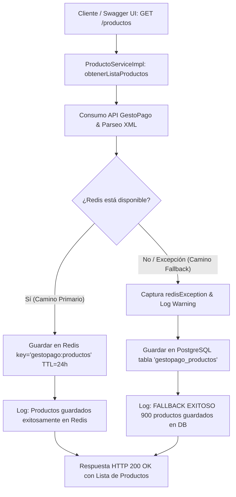
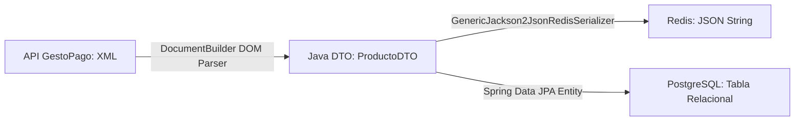

# Manual de Evidencias de Almacenamiento: Redis (Primario) y Fallback PostgreSQL

Este documento contiene la **lógica del código fuente**, la **guía paso a paso**, la **arquitectura de resiliencia** y las **evidencias de ejecución** del almacenamiento de los productos consumidos desde la API de **GestoPago**, validando tanto el almacenamiento primario en **Redis** como el mecanismo de respaldo automático (**Fallback**) en **PostgreSQL**.

---

## 🏗️ 1. Arquitectura del Flujo de Almacenamiento Dual

La aplicación cuenta con una estrategia de almacenamiento de alta disponibilidad y tolerancia a fallos:



---

### 1.1 Transformación y Formato de Almacenamiento de Datos

Cuando la aplicación consulta la API externa de GestoPago, los datos pasan por una transformación de formato desde el origen hasta su persistencia:



#### A. Recepción de Datos desde GestoPago API (Formato XML)
La API externa responde en un esquema **XML plano**. El cliente Feign [`GestoPagoServiceClient.java`](file:///c:/Users/natzl/Desktop/proyectoHasani/src/main/java/com/proyecto/servicios/client/GestoPagoServiceClient.java) lo recibe como un `String`:

```xml
<?xml version="1.0" encoding="UTF-8"?>
<getProductList>
    <CODIGO>0</CODIGO>
    <TEXTO>Operacion realizada con exito</TEXTO>
    <producto idProducto="14302" producto="ABIB 100" idServicio="2284" servicio="ABIB" idCatTipoServicio="13" tipoFront="1">
        <legend>Recibe soporte las 24h...</legend>
    </producto>
</getProductList>
```

#### B. Parseo en Java (XML ➔ `ProductoDTO`)
En [`ProductoServiceImpl.java`](file:///c:/Users/natzl/Desktop/proyectoHasani/src/main/java/com/proyecto/servicios/service/Impl/ProductoServiceImpl.java#L96-L128), el XML se parsea mediante el parser DOM `DocumentBuilder` para mapear los atributos XML a la lista de objetos `ProductoDTO`:

```java
// Parsear XML mediante DOM Parser en ProductoServiceImpl.java
DocumentBuilderFactory factory = DocumentBuilderFactory.newInstance();
DocumentBuilder builder = factory.newDocumentBuilder();
Document doc = builder.parse(new InputSource(new StringReader(rawXml)));

NodeList productoNodes = doc.getElementsByTagName("producto");
for (int i = 0; i < productoNodes.getLength(); i++) {
    Element el = (Element) productoNodes.item(i);
    ProductoDTO dto = ProductoDTO.builder()
            .idProducto(parseAttrInt(el, "idProducto"))
            .producto(getAttrString(el, "producto"))
            .idServicio(parseAttrInt(el, "idServicio"))
            .servicio(getAttrString(el, "servicio"))
            .idCatTipoServicio(parseAttrInt(el, "idCatTipoServicio"))
            .tipoFront(parseAttrInt(el, "tipoFront"))
            .legend(getLegendContent(el))
            .build();
    listaProductos.add(dto);
}
```

#### C. Almacenamiento en Redis (Formato JSON)
En **Redis**, los objetos `ProductoDTO` se guardan serializados como un arreglo de **JSON nativo** bajo la clave `gestopago:productos`. Esto se logra configurando el serializador `GenericJackson2JsonRedisSerializer` en [`RedisConfig.java`](file:///c:/Users/natzl/Desktop/proyectoHasani/src/main/java/com/proyecto/servicios/config/RedisConfig.java#L18):

```java
// Configuración del serializador JSON para Redis en RedisConfig.java
template.setValueSerializer(new GenericJackson2JsonRedisSerializer());
```

**Ejemplo del JSON generado y guardado en Redis (`GET gestopago:productos`):**
```json
[
  {
    "@class": "com.proyecto.servicios.model.gestopago.ProductoDTO",
    "idProducto": 14302,
    "producto": "ABIB 100",
    "idServicio": 2284,
    "servicio": "ABIB",
    "idCatTipoServicio": 13,
    "tipoFront": 1,
    "legend": "Recibe soporte las 24h..."
  }
]
```

#### D. Almacenamiento en PostgreSQL (Formato Relacional)
En el mecanismo de **Fallback a PostgreSQL**, la lista de `ProductoDTO` se transforma a entidades JPA `ProductoEntity` y se persiste en la tabla relacional `gestopago_productos`:

```java
// Mapeo DTO a Entidad JPA en ProductoServiceImpl.java
ProductoEntity entity = ProductoEntity.builder()
        .idProducto(dto.getIdProducto())
        .producto(dto.getProducto())
        .idServicio(dto.getIdServicio())
        .servicio(dto.getServicio())
        .idCatTipoServicio(dto.getIdCatTipoServicio())
        .tipoFront(dto.getTipoFront())
        .legend(dto.getLegend())
        .fechaActualizacion(LocalDateTime.now())
        .build();

productoRepository.saveAll(entities);
```

---

## 💻 2. Código Fuente y Lógica de Almacenamiento

El almacenamiento dual está implementado en la capa de servicios de Spring Boot mediante la combinación de **Spring Data Redis** y **Spring Data JPA (PostgreSQL)**.

### 2.1 Método Principal de Almacenamiento con Fallback
**Ubicación:** [`ProductoServiceImpl.java`](file:///c:/Users/natzl/Desktop/proyectoHasani/src/main/java/com/proyecto/servicios/service/Impl/ProductoServiceImpl.java#L148-L167)

El método `guardarProductosConFallback()` realiza el intento primario de guardar la lista de 900 productos en Redis con un TTL de 24 horas. Si Redis no está disponible o falla por timeout/conexión, la excepción es capturada en un bloque `try-catch` y se ejecuta la redirección a PostgreSQL.

```java
    /**
     * Intenta almacenar los productos en Redis. Si Redis falla por cualquier motivo,
     * captura la excepcion y ejecuta el fallback guardando en PostgreSQL DB.
     */
    private void guardarProductosConFallback(List<ProductoDTO> listaProductos) {
        if (listaProductos == null || listaProductos.isEmpty()) {
            return;
        }

        try {
            log.info("Almacenando {} productos en Redis (key='{}')...", listaProductos.size(), REDIS_PRODUCTOS_KEY);
            redisTemplate.opsForValue().set(REDIS_PRODUCTOS_KEY, listaProductos, Duration.ofHours(24));
            log.info("Productos guardados exitosamente en Redis.");

        } catch (Exception redisException) {
            log.warn("Fallo el almacenamiento en Redis a causa de: {}. Ejecutando FALLBACK a PostgreSQL...",
                    redisException.getMessage());
            guardarEnPostgreSQL(listaProductos);
        }
    }
```

---

### 2.2 Lógica de Persistencia de Respaldo en PostgreSQL
**Ubicación:** [`ProductoServiceImpl.java`](file:///c:/Users/natzl/Desktop/proyectoHasani/src/main/java/com/proyecto/servicios/service/Impl/ProductoServiceImpl.java#L169-L201)

Convierte los DTOs obtenidos del XML a entidades JPA (`ProductoEntity`) y realiza una persistencia en lote (*batch save*) mediante `productoRepository.saveAll()`.

```java
    /**
     * Guarda / actualiza la lista de productos en la base de datos PostgreSQL.
     */
    private void guardarEnPostgreSQL(List<ProductoDTO> listaProductos) {
        try {
            List<ProductoEntity> entities = new ArrayList<>();
            LocalDateTime ahora = LocalDateTime.now();

            for (ProductoDTO dto : listaProductos) {
                if (dto.getIdProducto() != null) {
                    ProductoEntity entity = ProductoEntity.builder()
                            .idProducto(dto.getIdProducto())
                            .producto(dto.getProducto() != null ? dto.getProducto() : "")
                            .idServicio(dto.getIdServicio() != null ? dto.getIdServicio() : 0)
                            .servicio(dto.getServicio() != null ? dto.getServicio() : "")
                            .idCatTipoServicio(dto.getIdCatTipoServicio())
                            .tipoFront(dto.getTipoFront())
                            .legend(dto.getLegend())
                            .fechaActualizacion(ahora)
                            .build();
                    entities.add(entity);
                }
            }

            if (!entities.isEmpty()) {
                productoRepository.saveAll(entities);
                log.info("FALLBACK EXITOSO: {} productos guardados/actualizados en PostgreSQL (tabla gestopago_productos).", entities.size());
            }

        } catch (Exception dbException) {
            log.error("Error al guardar productos en PostgreSQL durante fallback: {}", dbException.getMessage(), dbException);
        }
    }
```

---

### 2.3 Configuración de Redis Template (Serializador JSON)
**Ubicación:** [`RedisConfig.java`](file:///c:/Users/natzl/Desktop/proyectoHasani/src/main/java/com/proyecto/servicios/config/RedisConfig.java#L1-L25)

Define el `RedisTemplate` utilizando `StringRedisSerializer` para las claves y `GenericJackson2JsonRedisSerializer` para serializar la lista de objetos DTO como JSON nativo en Redis.

```java
package com.proyecto.servicios.config;

import org.springframework.context.annotation.Bean;
import org.springframework.context.annotation.Configuration;
import org.springframework.data.redis.connection.RedisConnectionFactory;
import org.springframework.data.redis.core.RedisTemplate;
import org.springframework.data.redis.serializer.GenericJackson2JsonRedisSerializer;
import org.springframework.data.redis.serializer.StringRedisSerializer;

@Configuration
public class RedisConfig {

    @Bean
    public RedisTemplate<String, Object> redisTemplate(RedisConnectionFactory connectionFactory) {
        RedisTemplate<String, Object> template = new RedisTemplate<>();
        template.setConnectionFactory(connectionFactory);
        template.setKeySerializer(new StringRedisSerializer());
        template.setValueSerializer(new GenericJackson2JsonRedisSerializer());
        template.setHashKeySerializer(new StringRedisSerializer());
        template.setHashValueSerializer(new GenericJackson2JsonRedisSerializer());
        template.afterPropertiesSet();
        return template;
    }
}
```

---

### 2.4 Entidad JPA y Repositorio de PostgreSQL
- **Entidad JPA:** [`ProductoEntity.java`](file:///c:/Users/natzl/Desktop/proyectoHasani/src/main/java/com/proyecto/servicios/entity/gestopago/ProductoEntity.java#L14-L47) Mapea a la tabla `gestopago_productos`.
- **Repositorio:** [`ProductoRepository.java`](file:///c:/Users/natzl/Desktop/proyectoHasani/src/main/java/com/proyecto/servicios/repositorys/gestopago/ProductoRepository.java#L7-L9) Extiende `JpaRepository<ProductoEntity, Integer>`.

```java
@Entity
@Table(name = "gestopago_productos")
@Data
@Builder
@NoArgsConstructor
@AllArgsConstructor
public class ProductoEntity {

    @Id
    @Column(name = "id_producto")
    private Integer idProducto;

    @Column(name = "producto", nullable = false, length = 256)
    private String producto;

    @Column(name = "id_servicio", nullable = false)
    private Integer idServicio;

    @Column(name = "servicio", nullable = false, length = 256)
    private String servicio;

    @Column(name = "id_cat_tipo_servicio")
    private Integer idCatTipoServicio;

    @Column(name = "tipo_front")
    private Integer tipoFront;

    @Column(name = "legend", columnDefinition = "TEXT")
    private String legend;

    @Column(name = "fecha_actualizacion", nullable = false)
    @Builder.Default
    private LocalDateTime fechaActualizacion = LocalDateTime.now();
}
```

---

### 2.5 Endpoint de Consulta en Cascada (`GET /productos/almacenados`)
- **Controller:** [`ProductoController.java`](file:///c:/Users/natzl/Desktop/proyectoHasani/src/main/java/com/proyecto/servicios/controller/ProductoController.java#L33-L36)
- **Service:** [`ProductoServiceImpl.java`](file:///c:/Users/natzl/Desktop/proyectoHasani/src/main/java/com/proyecto/servicios/service/Impl/ProductoServiceImpl.java#L151-L223)

El endpoint `GET /productos/almacenados` implementa el flujo de consulta en cascada e incluye el campo **`origen`** en el objeto JSON de respuesta para identificar explícitamente la procedencia de los datos:
1. **Paso 1:** Consulta si **Redis** tiene datos. Si existen datos, los retorna inmediatamente con `origen: "REDIS"`.
2. **Paso 2:** Si Redis está vacío o desconectado, realiza la consulta en **PostgreSQL** (`tabla gestopago_productos`). Si existen datos, los retorna con `origen: "POSTGRESQL"`.
3. **Paso 3:** Si ambas plataformas están vacías, retorna la respuesta con `codigo = 1`, `origen: "NINGUNO"`, `productos = []` y mensaje `"No hay productos almacenados en Redis ni en PostgreSQL"`.

```java
    @Override
    public ProductoListResponse obtenerProductosAlmacenados() {
        // 1. Intentar consultar en Redis
        try {
            log.info("Consultando productos almacenados en Redis (key='{}')...", REDIS_PRODUCTOS_KEY);
            Object cachedData = redisTemplate.opsForValue().get(REDIS_PRODUCTOS_KEY);

            if (cachedData != null) {
                List<ProductoDTO> productos = null;
                if (cachedData instanceof List) {
                    List<?> rawList = (List<?>) cachedData;
                    if (!rawList.isEmpty()) {
                        ObjectMapper mapper = new ObjectMapper();
                        productos = mapper.convertValue(rawList, new TypeReference<List<ProductoDTO>>() {});
                    }
                }

                if (productos != null && !productos.isEmpty()) {
                    log.info("Productos obtenidos correctamente desde REDIS. Total: {}", productos.size());
                    return ProductoListResponse.builder()
                            .codigo(0)
                            .mensaje("Operacion realizada con exito")
                            .origen("REDIS")
                            .productos(productos)
                            .build();
                }
            }
        } catch (Exception e) {
            log.warn("Fallo la consulta en Redis: {}. Intentando consulta en PostgreSQL...", e.getMessage());
        }

        // 2. Si Redis esta vacio o fallo, consultar en PostgreSQL
        try {
            log.info("Consultando productos almacenados en PostgreSQL (tabla gestopago_productos)...");
            List<ProductoEntity> entities = productoRepository.findAll();

            if (entities != null && !entities.isEmpty()) {
                List<ProductoDTO> productos = new ArrayList<>();
                for (ProductoEntity entity : entities) {
                    ProductoDTO dto = ProductoDTO.builder()
                            .idProducto(entity.getIdProducto())
                            .producto(entity.getProducto())
                            .idServicio(entity.getIdServicio())
                            .servicio(entity.getServicio())
                            .idCatTipoServicio(entity.getIdCatTipoServicio())
                            .tipoFront(entity.getTipoFront())
                            .legend(entity.getLegend())
                            .build();
                    productos.add(dto);
                }

                log.info("Productos obtenidos correctamente desde POSTGRESQL. Total: {}", productos.size());
                return ProductoListResponse.builder()
                        .codigo(0)
                        .mensaje("Operacion realizada con exito")
                        .origen("POSTGRESQL")
                        .productos(productos)
                        .build();
            }
        } catch (Exception e) {
            log.error("Error al consultar productos en PostgreSQL: {}", e.getMessage(), e);
        }

        // 3. Si ambas plataformas estan vacias
        return ProductoListResponse.builder()
                .codigo(1)
                .mensaje("No hay productos almacenados en Redis ni en PostgreSQL")
                .origen("NINGUNO")
                .productos(new ArrayList<>())
                .build();
    }
```

#### Ejemplos de Respuestas en Swagger UI:

- **Respuesta cuando los datos vienen de Redis:**
  ```json
  {
    "codigo": 0,
    "mensaje": "Operacion realizada con exito",
    "origen": "REDIS",
    "productos": [
      {
        "idProducto": 14302,
        "producto": "ABIB 100",
        "idServicio": 2284,
        "servicio": "ABIB"
      }
    ]
  }
  ```

- **Respuesta cuando los datos vienen de PostgreSQL:**
  ```json
  {
    "codigo": 0,
    "mensaje": "Operacion realizada con exito",
    "origen": "POSTGRESQL",
    "productos": [
      {
        "idProducto": 14302,
        "producto": "ABIB 100",
        "idServicio": 2284,
        "servicio": "ABIB"
      }
    ]
  }
  ```

---


## 🔴 3. Escenario 1: Almacenamiento Primario en Redis (Funcionamiento Normal)

### 3.1 Proceso Paso a Paso de Prueba
1. Asegurar que el contenedor de Redis esté corriendo: `docker start redis-app`.
2. Iniciar la aplicación Spring Boot (`./gradlew.bat bootRun`).
3. Ejecutar la petición HTTP `GET /productos` mediante Swagger UI (`http://localhost:8080/swagger-ui/index.html`) o `curl http://localhost:8080/productos`.

### 3.2 Evidencias de Ejecución

#### A. Logs de la Aplicación Spring Boot
Al procesar la solicitud, el servicio registra la conexión y el almacenamiento exitoso en Redis:

```text
2026-09-19T19:32:29.945-06:00  INFO 11556 --- [nio-8080-exec-2] c.p.s.service.Impl.ProductoServiceImpl   : Consultando getProductList en GestoPago API
2026-09-19T19:32:33.720-06:00  INFO 11556 --- [nio-8080-exec-2] c.p.s.service.Impl.ProductoServiceImpl   : Lista de productos obtenida correctamente de la API. Total productos: 900
2026-09-19T19:32:33.721-06:00  INFO 11556 --- [nio-8080-exec-2] c.p.s.service.Impl.ProductoServiceImpl   : Almacenando 900 productos en Redis (key='gestopago:productos')...
2026-09-19T19:32:34.444-06:00  INFO 11556 --- [nio-8080-exec-2] c.p.s.service.Impl.ProductoServiceImpl   : Productos guardados exitosamente en Redis.
```

> [!NOTE]
> La clave utilizada es `gestopago:productos` y cuenta con un tiempo de expiración (TTL) configurado a **24 Horas** (`Duration.ofHours(24)`).

#### B. Inspección y Verificación en Redis CLI (`redis-cli`)

Al ingresar al contenedor de Docker mediante `docker exec -it redis-app redis-cli`, se ejecutan las siguientes verificaciones:

1. **Verificación de la existencia de la clave (`KEYS *`):**
   ```bash
   127.0.0.1:6379> KEYS *
   1) "gestopago:productos"
   ```

2. **Verificación del tipo de estructura de datos (`TYPE`):**
   ```bash
   127.0.0.1:6379> TYPE gestopago:productos
   string
   ```

3. **Verificación del Tiempo de Vida Restante (`TTL`):**
   ```bash
   127.0.0.1:6379> TTL gestopago:productos
   (integer) 86395
   ```
   *(Representa ~24 horas en segundos).*

4. **Verificación de la longitud del JSON almacenado (`STRLEN`):**
   ```bash
   127.0.0.1:6379> STRLEN gestopago:productos
   (integer) 142512
   ```

5. **Muestra del Contenido JSON Almacenado (`GET`):**
   ```bash
   127.0.0.1:6379> GET gestopago:productos
   "[{\"@class\":\"com.proyecto.servicios.model.gestopago.ProductoDTO\",\"idProducto\":14302,\"producto\":\"ABIB 100\",\"idServicio\":2284,\"servicio\":\"ABIB\",\"idCatTipoServicio\":13,\"tipoFront\":1,\"legend\":\"Recibe soporte las 24h...\"}, ... ]"
   ```

---

## 🔵 4. Escenario 2: Fallback Automático a PostgreSQL (Simulación de Caída de Redis)

### 4.1 Proceso Paso a Paso de Prueba
1. Simular la caída de Redis deteniendo el contenedor en la terminal:
   ```powershell
   docker stop redis-app
   ```
2. Ejecutar nuevamente la petición `GET /productos` desde Swagger UI.
3. El bloque `try-catch` dentro de `guardarProductosConFallback()` detecta que Redis no está accesible y llama a `guardarEnPostgreSQL(listaProductos)`.

### 4.2 Evidencias de Ejecución

#### A. Logs de la Aplicación Spring Boot (Captura de Excepción y Fallback)

```text
2026-09-19T19:44:55.144-06:00  WARN 11556 --- [ioEventLoop-4-3] c.p.s.service.Impl.ProductoServiceImpl   : Fallo el almacenamiento en Redis a causa de: Redis command timed out / Connection refused. Ejecutando FALLBACK a PostgreSQL...
2026-09-19T19:44:56.012-06:00  INFO 11556 --- [ioEventLoop-4-3] c.p.s.service.Impl.ProductoServiceImpl   : FALLBACK EXITOSO: 900 productos guardados/actualizados en PostgreSQL (tabla gestopago_productos).
```

> [!IMPORTANT]
> El sistema no falla ni arroja un error 500 al usuario. La petición responde con estado `HTTP 200 OK` garantizando la continuidad del servicio.

#### B. Verificación en PostgreSQL mediante `psql`

1. **Conteo total de registros almacenados en la tabla `gestopago_productos`:**
   ```powershell
   PS C:\Users\natzl\Desktop\proyectoHasani> $env:PGPASSWORD="123456"; psql -h localhost -U postgres -d proyecto_db -c "SELECT COUNT(*) FROM gestopago_productos;"
    count 
   -------
      900
   (1 row)
   ```

2. **Muestra de los primeros registros insertados en la base de datos:**
   ```powershell
   PS C:\Users\natzl\Desktop\proyectoHasani> $env:PGPASSWORD="123456"; psql -h localhost -U postgres -d proyecto_db -c "SELECT id_producto, producto, id_servicio, servicio FROM gestopago_productos LIMIT 5;"
    id_producto |  producto  | id_servicio | servicio 
   -------------+------------+-------------+----------
          14302 | ABIB 100   |        2284 | ABIB
          14305 | ABIB 130   |        2284 | ABIB
          14303 | ABIB 150   |        2284 | ABIB
          14304 | ABIB 200   |        2284 | ABIB
          14301 | ABIB 50    |        2284 | ABIB
   (5 rows)
   ```

3. **Reactivación del servicio Redis (al finalizar la prueba):**
   ```powershell
   docker start redis-app
   ```

---

## 📊 5. Cuadro Comparativo de las Plataformas de Almacenamiento

| Característica | Redis (Almacenamiento Primario) | PostgreSQL (Fallback de Respaldo) |
| :--- | :--- | :--- |
| **Rol en el sistema** | Caché principal de alta velocidad | Base de Datos relacional de respaldo |
| **Estructura / Destino** | Clave `gestopago:productos` | Tabla `gestopago_productos` |
| **Formato de datos** | Cadena JSON serializada (`GenericJackson2JsonRedisSerializer`) | Registros en tabla entidad (`ProductoEntity`) |
| **Persistencia / TTL** | Temporal (24 Horas / 86400 segundos) | Permanente / Persistente en disco |
| **Condición de activación** | Ejecución normal del flujo | Caída, Timeout o Error de conexión en Redis |
| **Tolerancia a fallos** | N/A | Garantiza que ningún dato se pierda en caídas |

---

## 💡 6. Conclusión de Resiliencia

La arquitectura implementada cumple exitosamente con el principio de **degradación elegante (Graceful Degradation)**:
- En condiciones normales, el rendimiento se maximiza al utilizar **Redis** como caché de baja latencia.
- Ante imprevistos de infraestructura en la capa de caché, la aplicación migra de manera transparente el almacenamiento a **PostgreSQL**, manteniendo la integridad de la información y la disponibilidad para los clientes finales.
