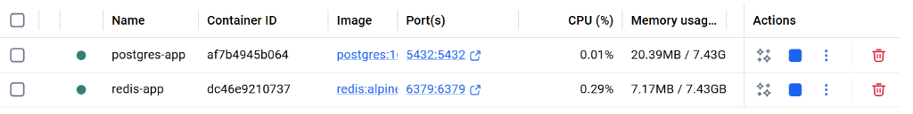
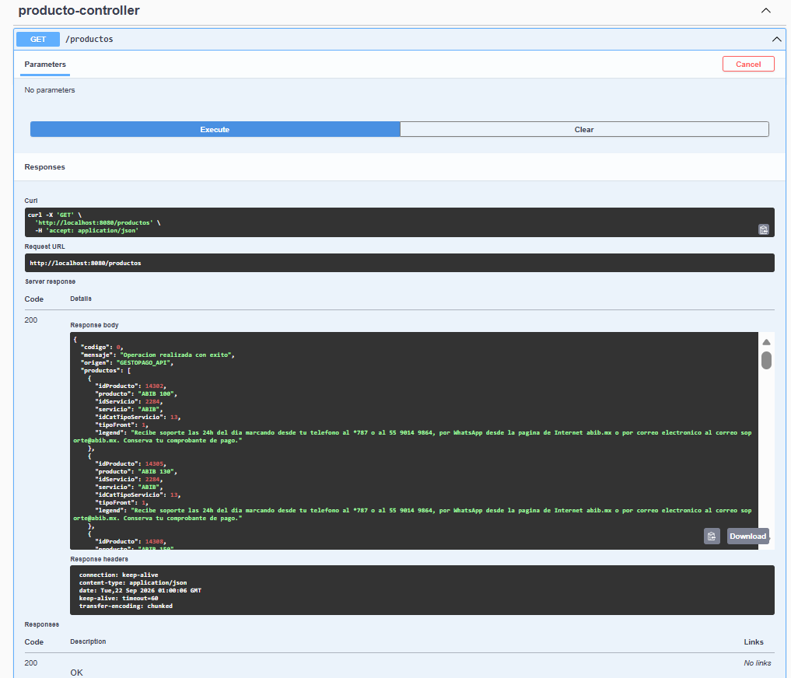
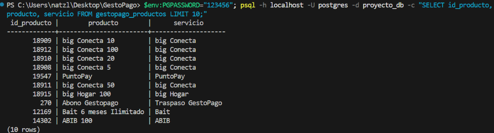
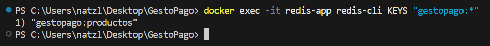
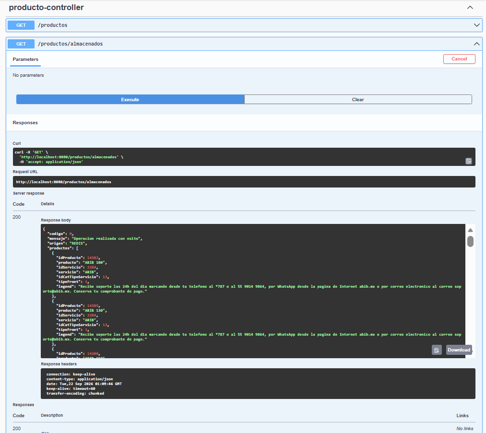
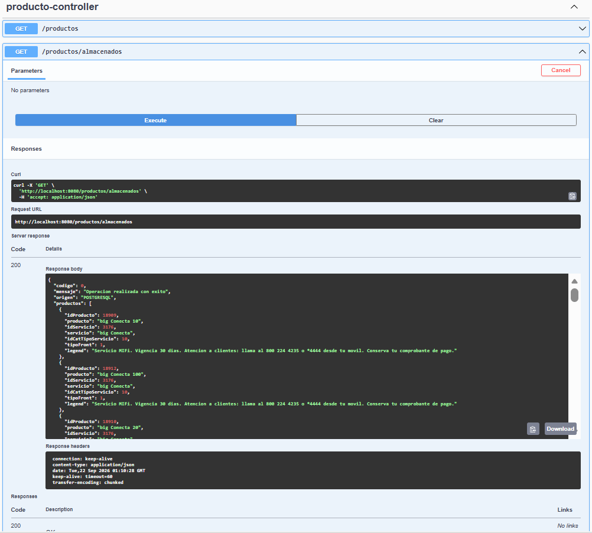

# 🧪 Manual de Pruebas Manuales y Evidencia de Ejecución

Este documento guía paso a paso la realización de las pruebas manuales del microservicio **GestoPago**, verificando la correcta integración con la API externa, la persistencia en **PostgreSQL**, el almacenamiento en **Redis** y la tolerancia a fallos.

---

## 📋 Resumen de Escenarios de Prueba

| ID | Escenario de Prueba | Componentes Involucrados | Resultado Esperado |
| :--- | :--- | :--- | :--- |
| **TC-01** | Verificación de Servicios e Infraestructura | Docker / PostgreSQL / Redis | Contenedores activos y escuchando puertos 5432 y 6379. |
| **TC-02** | Consulta API Externa y Almacenamiento Dual | Swagger UI / Feign Client / DBs | Retorno HTTP 200 con `origen: "GESTOPAGO_API"` y guardado simultáneo. |
| **TC-03** | Verificación de Persistencia en PostgreSQL | PostgreSQL (`gestopago_productos`) | Registros guardados físicamente en la tabla SQL. |
| **TC-04** | Verificación de Caché en Redis | Redis (`gestopago:productos`) | Clave JSON guardada con TTL de 24h. |
| **TC-05** | Consulta a Almacenamiento Local | Swagger UI / Redis / PostgreSQL | Retorno HTTP 200 ultra rápido con `origen: "REDIS"`. |
| **TC-06** | Tolerancia a Fallos y Fallback | Redis / PostgreSQL / API Externa | Respuesta continua ante fallos de infraestructura sin caída de app. |

---

## 🔬 Guía de Pasos y Marcadores de Evidencia

### 🔹 TC-01: Verificación de Servicios e Infraestructura Docker
**Descripción**: Verificar que la base de datos PostgreSQL y la caché Redis se encuentren encendidas y escuchando peticiones.
* **Pasos**:
  1. Abrir la terminal o consola de comandos.
  2. Ejecutar `docker ps` o abrir la interfaz gráfica de Docker Desktop.
  3. Confirmar que los contenedores de `postgres` y `redis` estén en estado `Up`.

<!-- REEMPLAZAR ESTE MARCADOR CON LA CAPTURA REAL DE DOCKER -->


---

### 🔹 TC-02: Consulta a API Externa de GestoPago y Almacenamiento (`GET /productos`)
**Descripción**: Ejecutar la petición en Swagger UI para consumir la API en vivo y disparar el almacenamiento automático.
* **Pasos**:
  1. Ingresar a Swagger UI en el navegador: `http://localhost:8080/swagger-ui.html`.
  2. Desplegar el endpoint `GET /productos`.
  3. Hacer clic en **Try it out** y luego en **Execute**.
  4. Verificar que el código de respuesta HTTP sea `200 OK` y que el campo `"origen"` indique `"GESTOPAGO_API"`.

<!-- REEMPLAZAR ESTE MARCADOR CON LA CAPTURA REAL DE SWAGGER GET /productos -->


---

### 🔹 TC-03: Verificación de Persistencia en PostgreSQL
**Descripción**: Validar que los productos retornados por la API fueron insertados/actualizados correctamente en la base de datos PostgreSQL.
* **Pasos**:
  1. Abrir el gestor de base de datos (pgAdmin, DBeaver, IntelliJ Database o psql).
  2. Conectarse a la base de datos `db_gestopago`.
  3. Ejecutar la siguiente consulta SQL:
     ```sql
     SELECT id_producto, producto, servicio, id_cat_tipo_servicio, fecha_actualizacion 
     FROM gestopago_productos 
     ORDER BY fecha_actualizacion DESC;
     ```
  4. Confirmar que existan registros almacenados.

<!-- REEMPLAZAR ESTE MARCADOR CON LA CAPTURA REAL DE LA CONSULTA SQL EN POSTGRESQL -->


---

### 🔹 TC-04: Verificación de Memoria Caché en Redis
**Descripción**: Comprobar la presencia de la clave `gestopago:productos` guardada en Redis.
* **Pasos**:
  1. Abrir la terminal de Redis mediante `docker exec -it redis redis-cli` o Redis Insight.
  2. Ejecutar el comando para verificar la clave existente:
     ```bash
     KEYS gestopago:*
     ```
  3. Verificar el tiempo de vida de la clave (TTL):
     ```bash
     TTL gestopago:productos
     ```

<!-- REEMPLAZAR ESTE MARCADOR CON LA CAPTURA REAL DE REDIS CLI / REDIS INSIGHT -->


---

### 🔹 TC-05: Consulta a Almacenamiento Local (`GET /productos/almacenados`)
**Descripción**: Probar la lectura ultra rápida desde la memoria caché de Redis sin realizar consumos externos.
* **Pasos**:
  1. Ir a Swagger UI `http://localhost:8080/swagger-ui.html`.
  2. Desplegar el endpoint `GET /productos/almacenados`.
  3. Ejecutar la petición.
  4. Validar que la respuesta contenga `"origen": "REDIS"` y la lista completa de productos.

<!-- REEMPLAZAR ESTE MARCADOR CON LA CAPTURA REAL DE SWAGGER GET /productos/almacenados -->


---

### 🔹 TC-06: Tolerancia a Fallos y Fallback Automático
**Descripción**: Validar el comportamiento del sistema ante fallos o bases de datos vacías.
* **Pasos**:
  1. Detener temporalmente la caché de Redis (`docker stop redis`).
  2. Ejecutar nuevamente `GET /productos/almacenados` en Swagger.
  3. Verificar que el sistema no falla y responde automáticamente con `"origen": "POSTGRESQL"`.
  4. En caso de estar ambas BDs vacías, validar que realiza la consulta en vivo a la API remota y regenera ambas copias (`"origen": "GESTOPAGO_API"`).

<!-- REEMPLAZAR ESTE MARCADOR CON LA CAPTURA REAL DE FALLBACK Y LOGS -->

