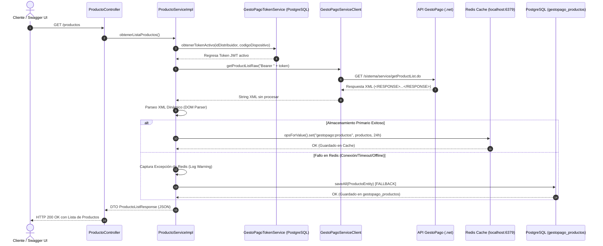

# Manual Técnico: Integración del Endpoint `getProductList` (GestoPago) con Redis y Fallback PostgreSQL

Este manual documenta paso a paso la arquitectura, el código implementado y las configuraciones para consumir y exponer la lista de productos y servicios de **GestoPago** en la aplicación Spring Boot, utilizando **Redis** como almacenamiento primario (Cache) y **PostgreSQL** como almacenamiento de respaldo (Fallback).

---

## 🏗️ Arquitectura del Flujo de Datos (Redis Primario + Fallback PostgreSQL)



---

## 🛠️ Paso 1: Configuración del Cliente HTTP con OpenFeign

### Código: [`GestoPagoServiceClient.java`](file:///c:/Users/natzl/Desktop/proyectoHasani/src/main/java/com/proyecto/servicios/client/GestoPagoServiceClient.java)

```java
package com.proyecto.servicios.client;

import org.springframework.cloud.openfeign.FeignClient;
import org.springframework.web.bind.annotation.GetMapping;
import org.springframework.web.bind.annotation.RequestHeader;

@FeignClient(name = "gestoPagoService", url = "${gestopago.service.url}")
public interface GestoPagoServiceClient {

    @GetMapping(value = "/sistema/service/getProductList.do")
    String getProductListRaw(@RequestHeader("Authorization") String bearerToken);
}
```

---

## 📦 Paso 2: Modelos de Datos (DTOs, Entidades JPA y Redis Config)

### 2.1 Modelo DTO de Producto: [`ProductoDTO.java`](file:///c:/Users/natzl/Desktop/proyectoHasani/src/main/java/com/proyecto/servicios/model/gestopago/ProductoDTO.java)

```java
package com.proyecto.servicios.model.gestopago;

import com.fasterxml.jackson.annotation.JsonIgnoreProperties;
import com.fasterxml.jackson.annotation.JsonInclude;
import lombok.AllArgsConstructor;
import lombok.Builder;
import lombok.Data;
import lombok.NoArgsConstructor;

@Data
@Builder
@NoArgsConstructor
@AllArgsConstructor
@JsonIgnoreProperties(ignoreUnknown = true)
@JsonInclude(JsonInclude.Include.NON_NULL)
public class ProductoDTO {

    private Integer idProducto;
    private String producto;
    private Integer idServicio;
    private String servicio;
    private Integer idCatTipoServicio;
    private Integer tipoFront;
    private String legend;
}
```

### 2.2 Entidad PostgreSQL: [`ProductoEntity.java`](file:///c:/Users/natzl/Desktop/proyectoHasani/src/main/java/com/proyecto/servicios/entity/gestopago/ProductoEntity.java)

```java
package com.proyecto.servicios.entity.gestopago;

import jakarta.persistence.Column;
import jakarta.persistence.Entity;
import jakarta.persistence.Id;
import jakarta.persistence.Table;
import lombok.AllArgsConstructor;
import lombok.Builder;
import lombok.Data;
import lombok.NoArgsConstructor;

import java.time.LocalDateTime;

@Entity
@Table(name = "gestopago_productos")
@Data
@Builder
@NoArgsConstructor
@AllArgsConstructor
public class ProductoEntity {

    @Id
    @Column(name = "id_producto")
    private Integer idProducto;

    @Column(name = "producto", nullable = false, length = 256)
    private String producto;

    @Column(name = "id_servicio", nullable = false)
    private Integer idServicio;

    @Column(name = "servicio", nullable = false, length = 256)
    private String servicio;

    @Column(name = "id_cat_tipo_servicio")
    private Integer idCatTipoServicio;

    @Column(name = "tipo_front")
    private Integer tipoFront;

    @Column(name = "legend", columnDefinition = "TEXT")
    private String legend;

    @Column(name = "fecha_actualizacion", nullable = false)
    @Builder.Default
    private LocalDateTime fechaActualizacion = LocalDateTime.now();
}
```

### 2.3 Repositorio PostgreSQL: [`ProductoRepository.java`](file:///c:/Users/natzl/Desktop/proyectoHasani/src/main/java/com/proyecto/servicios/repositorys/gestopago/ProductoRepository.java)

```java
package com.proyecto.servicios.repositorys.gestopago;

import com.proyecto.servicios.entity.gestopago.ProductoEntity;
import org.springframework.data.jpa.repository.JpaRepository;
import org.springframework.stereotype.Repository;

@Repository
public interface ProductoRepository extends JpaRepository<ProductoEntity, Integer> {
}
```

### 2.4 Configuración de Redis: [`RedisConfig.java`](file:///c:/Users/natzl/Desktop/proyectoHasani/src/main/java/com/proyecto/servicios/config/RedisConfig.java)

```java
package com.proyecto.servicios.config;

import org.springframework.context.annotation.Bean;
import org.springframework.context.annotation.Configuration;
import org.springframework.data.redis.connection.RedisConnectionFactory;
import org.springframework.data.redis.core.RedisTemplate;
import org.springframework.data.redis.serializer.GenericJackson2JsonRedisSerializer;
import org.springframework.data.redis.serializer.StringRedisSerializer;

@Configuration
public class RedisConfig {

    @Bean
    public RedisTemplate<String, Object> redisTemplate(RedisConnectionFactory connectionFactory) {
        RedisTemplate<String, Object> template = new RedisTemplate<>();
        template.setConnectionFactory(connectionFactory);
        template.setKeySerializer(new StringRedisSerializer());
        template.setValueSerializer(new GenericJackson2JsonRedisSerializer());
        template.setHashKeySerializer(new StringRedisSerializer());
        template.setHashValueSerializer(new GenericJackson2JsonRedisSerializer());
        template.afterPropertiesSet();
        return template;
    }
}
```

---

## ⚙️ Paso 3: Capa de Servicio con Almacenamiento Redis + Fallback PostgreSQL

### Código: [`ProductoServiceImpl.java`](file:///c:/Users/natzl/Desktop/proyectoHasani/src/main/java/com/proyecto/servicios/service/Impl/ProductoServiceImpl.java)

```java
package com.proyecto.servicios.service.Impl;

import com.proyecto.servicios.client.GestoPagoServiceClient;
import com.proyecto.servicios.entity.gestopago.GestoPagoToken;
import com.proyecto.servicios.entity.gestopago.ProductoEntity;
import com.proyecto.servicios.model.gestopago.ProductoDTO;
import com.proyecto.servicios.model.gestopago.ProductoListResponse;
import com.proyecto.servicios.repositorys.gestopago.ProductoRepository;
import com.proyecto.servicios.service.GestoPagoTokenService;
import com.proyecto.servicios.service.ProductoService;
import lombok.extern.slf4j.Slf4j;
import org.springframework.beans.factory.annotation.Value;
import org.springframework.data.redis.core.RedisTemplate;
import org.springframework.stereotype.Service;
import org.w3c.dom.Document;
import org.w3c.dom.Element;
import org.w3c.dom.NodeList;
import org.xml.sax.InputSource;

import javax.xml.parsers.DocumentBuilder;
import javax.xml.parsers.DocumentBuilderFactory;
import java.io.StringReader;
import java.time.Duration;
import java.time.LocalDateTime;
import java.util.ArrayList;
import java.util.List;
import java.util.Optional;

@Service
@Slf4j
public class ProductoServiceImpl implements ProductoService {

    private static final String REDIS_PRODUCTOS_KEY = "gestopago:productos";

    private final GestoPagoServiceClient gestoPagoServiceClient;
    private final GestoPagoTokenService tokenService;
    private final ProductoRepository productoRepository;
    private final RedisTemplate<String, Object> redisTemplate;

    @Value("${gestopago.auth.id-distribuidor}")
    private Integer idDistribuidor;

    @Value("${gestopago.auth.codigo-dispositivo}")
    private String codigoDispositivo;

    public ProductoServiceImpl(GestoPagoServiceClient gestoPagoServiceClient,
                               GestoPagoTokenService tokenService,
                               ProductoRepository productoRepository,
                               RedisTemplate<String, Object> redisTemplate) {
        this.gestoPagoServiceClient = gestoPagoServiceClient;
        this.tokenService = tokenService;
        this.productoRepository = productoRepository;
        this.redisTemplate = redisTemplate;
    }

    @Override
    public ProductoListResponse obtenerListaProductos(String token) {
        try {
            log.info("Consultando getProductList en GestoPago API");
            String authHeader = token.startsWith("Bearer ") ? token : "Bearer " + token;
            String rawXml = gestoPagoServiceClient.getProductListRaw(authHeader);

            List<ProductoDTO> listaProductos = parseXmlToDTOs(rawXml);

            // Almacenar productos: Intento primario en Redis, con Fallback a PostgreSQL
            guardarProductosConFallback(listaProductos);

            return ProductoListResponse.builder()
                    .codigo(0)
                    .mensaje("Operacion realizada con exito")
                    .productos(listaProductos)
                    .build();

        } catch (Exception e) {
            log.error("Error al obtener la lista de productos de GestoPago: {}", e.getMessage(), e);
            return ProductoListResponse.builder()
                    .codigo(1)
                    .mensaje("Error al procesar la lista de productos: " + e.getMessage())
                    .productos(new ArrayList<>())
                    .build();
        }
    }

    private void guardarProductosConFallback(List<ProductoDTO> listaProductos) {
        if (listaProductos == null || listaProductos.isEmpty()) {
            return;
        }

        try {
            log.info("Almacenando {} productos en Redis (key='{}')...", listaProductos.size(), REDIS_PRODUCTOS_KEY);
            redisTemplate.opsForValue().set(REDIS_PRODUCTOS_KEY, listaProductos, Duration.ofHours(24));
            log.info("Productos guardados exitosamente en Redis.");

        } catch (Exception redisException) {
            log.warn("Fallo el almacenamiento en Redis a causa de: {}. Ejecutando FALLBACK a PostgreSQL...",
                    redisException.getMessage());
            guardarEnPostgreSQL(listaProductos);
        }
    }

    private void guardarEnPostgreSQL(List<ProductoDTO> listaProductos) {
        try {
            List<ProductoEntity> entities = new ArrayList<>();
            LocalDateTime ahora = LocalDateTime.now();

            for (ProductoDTO dto : listaProductos) {
                if (dto.getIdProducto() != null) {
                    ProductoEntity entity = ProductoEntity.builder()
                            .idProducto(dto.getIdProducto())
                            .producto(dto.getProducto() != null ? dto.getProducto() : "")
                            .idServicio(dto.getIdServicio() != null ? dto.getIdServicio() : 0)
                            .servicio(dto.getServicio() != null ? dto.getServicio() : "")
                            .idCatTipoServicio(dto.getIdCatTipoServicio())
                            .tipoFront(dto.getTipoFront())
                            .legend(dto.getLegend())
                            .fechaActualizacion(ahora)
                            .build();
                    entities.add(entity);
                }
            }

            if (!entities.isEmpty()) {
                productoRepository.saveAll(entities);
                log.info("FALLBACK EXITOSO: {} productos guardados/actualizados en PostgreSQL (tabla gestopago_productos).", entities.size());
            }

        } catch (Exception dbException) {
            log.error("Error al guardar productos en PostgreSQL durante fallback: {}", dbException.getMessage(), dbException);
        }
    }
}
```

---

## 🗄️ Paso 4: Migración de Base de Datos PostgreSQL (Flyway)

### Código: [`db/migration/V2__create_gestopago_productos.sql`](file:///c:/Users/natzl/Desktop/proyectoHasani/src/main/resources/db/migration/V2__create_gestopago_productos.sql)

```sql
CREATE TABLE IF NOT EXISTS gestopago_productos (
    id_producto           INTEGER PRIMARY KEY,
    producto              VARCHAR(256) NOT NULL,
    id_servicio           INTEGER NOT NULL,
    servicio              VARCHAR(256) NOT NULL,
    id_cat_tipo_servicio  INTEGER,
    tipo_front            INTEGER,
    legend                TEXT,
    fecha_actualizacion   TIMESTAMP NOT NULL DEFAULT NOW()
);
```

---

## 🧪 Paso 5: Pruebas Unitarias de Fallback

### Código: [`ProductoServiceTest.java`](file:///c:/Users/natzl/Desktop/proyectoHasani/src/test/java/com/proyecto/servicios/service/ProductoServiceTest.java)

Se prueban dos escenarios claves:
1. **Prueba Redis Éxito**: Cuando Redis responde OK, se guardan los datos en Redis y NO se llama a PostgreSQL.
2. **Prueba Redis Fallo**: Cuando Redis lanza excepción, el sistema captura el error y llama automáticamente a `productoRepository.saveAll(...)` en PostgreSQL.

---

## 🚀 Paso 6: Ejecución y Pruebas en Swagger UI

### 1. Iniciar la Aplicación
```powershell
.\gradlew.bat bootRun
```

### 2. Verificar el Funcionamiento
- Al ejecutar `GET /productos` en Swagger UI:
  - **Con Redis activo**: Los productos se guardan en la clave Redis `gestopago:productos`.
  - **Si apagas o detienes Redis**: Verás en la consola el log `Fallo el almacenamiento en Redis ... Ejecutando FALLBACK a PostgreSQL...` y los productos quedarán guardados en la tabla PostgreSQL `gestopago_productos`.

---

## 📄 Documentación Relacionada
- Para ver el paso a paso detallado, los comandos de prueba y las evidencias obtenidas en ambas plataformas (Redis y PostgreSQL), consulta: [**Manual de Evidencias de Almacenamiento (Redis + PostgreSQL)**](file:///c:/Users/natzl/Desktop/proyectoHasani/documentacion/manual_evidencia_almacenamiento_redis_postgres.md).

